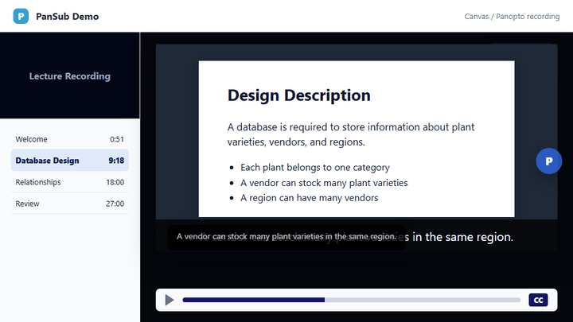
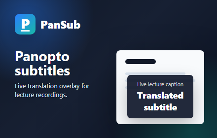
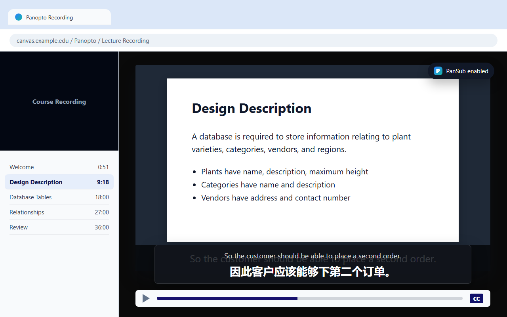
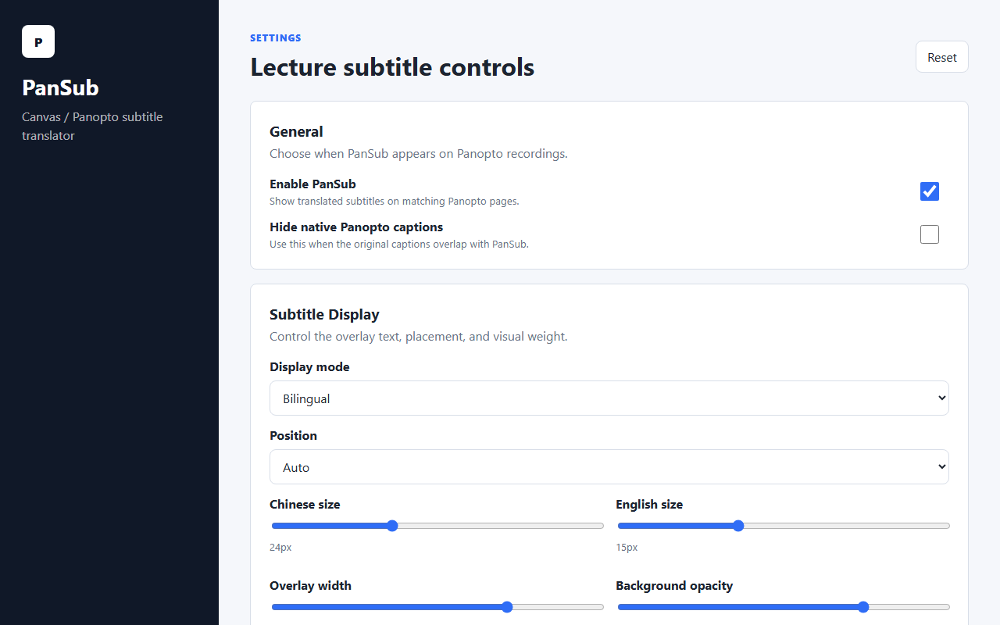

<p align="left">
  
</p>

# PanSub

PanSub 是一个 Chrome 扩展，用来在 Canvas / Panopto 课程录像里实时叠加中文字幕。打开 Panopto 自带英文字幕后，PanSub 会读取当前字幕，翻译成中文，并显示在播放器上方。

<p>
  <a href="https://chromewebstore.google.com/detail/chgafndhbmocpgbaellpbjckmnbkmdfe"><strong>从 Chrome 应用商店安装</strong></a>
</p>



## 快速安装

### 1. 找到 Chrome 扩展入口

打开 Chrome，点击右上角的扩展图标，然后进入 Chrome 应用商店。也可以直接打开：

[https://chromewebstore.google.com/detail/chgafndhbmocpgbaellpbjckmnbkmdfe](https://chromewebstore.google.com/detail/chgafndhbmocpgbaellpbjckmnbkmdfe)


### 2. 在商店搜索 PanSub

在 Chrome 应用商店搜索 `PanSub`，找到 **PanSub - Panopto 中文字幕**。



### 3. 添加到浏览器

点击 **添加至 Chrome**，确认安装。安装完成后，Chrome 右上角会出现 PanSub 扩展图标。

### 4. 打开 Panopto 课程录像

进入 Canvas / Panopto 课程录像页面，先打开 Panopto 自带字幕。PanSub 需要原始英文字幕作为翻译来源。



### 5. 完成，可以正常使用

点击 PanSub 图标，确认 **显示字幕** 已开启。默认双语模式会显示原文和译文；如果选择 **仅译文**，翻译完成前不会先放一个英文占位。很 easy。



## 目前功能

| 功能 | 说明 |
| --- | --- |
| 实时翻译字幕 | 读取 Panopto 英文字幕并叠加中文翻译 |
| 支持 Canvas / Panopto | 适配常见 Canvas 课程回放里的 Panopto 视频 |
| 支持两种字幕位置 | 支持视频内字幕和视频下方 docked 字幕 |
| 多种显示模式 | 支持双语、仅翻译、仅原文 |
| 可调显示效果 | 可调字幕大小、位置、宽度和背景透明度 |
| 字幕框自定义 | 支持样式预设、字体、颜色、拖动位置和锁定 |
| 悬浮快捷按钮 | 可拖动、可隐藏、可快速开关字幕 |
| 设置页语言切换 | 设置界面支持中文和英文 |
| 学术术语优化 | 内置跨学科术语表，覆盖 IT、商科、艺术、科学、法律等方向 |
| 全屏适配 | 全屏播放时字幕和悬浮按钮会进入播放器内部 |
| 本地缓存 | 重复字幕会优先使用本地缓存，减少重复翻译请求 |

## 更新日志

### 1.1.14

- 修复关闭 PanSub 后仍继续发送翻译请求的问题。
- 修复关闭 PanSub 后仍可能隐藏 Panopto 原生字幕的问题。
- 新增保守 fallback 字幕识别，适配更多 Panopto 播放器结构，同时避免误抓左侧 transcript。
- 新增发布包脚本，自动生成并验证 Chrome Web Store zip。
- 新增 options 页、fallback 字幕、学术术语保护等自动化测试。
- 优化缓存管理，限制内存缓存条数，避免长时间观看时无限增长。
- 增强存储失败日志，避免设置保存失败时静默误导用户。

### 1.1.13

- 新增字幕框样式预设、字体选择和颜色设置。
- 新增字幕框拖动定位，拖动后会自动保存为手动位置。
- 新增字幕框锁定按钮，锁定后不能继续拖动修改位置。
- 优化字幕框宽度，短句保持紧凑，长译文会自动放宽。
- 优化仅译文模式，翻译完成前不再先显示英文占位。

### 1.1.12

- 修复全屏模式下字幕跳到右上角再消失的问题。
- 修复字幕每进入下一句话时出现位置偏移的问题。
- 修复用户使用浏览器网页翻译后，PanSub 字幕层和 Panopto 原字幕被一起翻译导致错乱的问题。
- 优化字幕锚点，尽量贴合真实播放器区域，而不是整个浏览器窗口。
- 新增字幕框样式、字体、颜色、拖动定位和锁定按钮。
- 优化悬浮按钮，支持拖动、缩小、本次隐藏、按网站隐藏、全局隐藏和位置重置。
- 新增后台脚本，用更稳定的方式从页面打开 PanSub 设置页。

### 1.1.x

- 新增设置页，可调整显示模式、字幕位置、字号、宽度、透明度和界面语言。
- 新增 Chrome Web Store 素材、隐私说明和干净发布包。
- 新增学术术语表，减少专业课程里的生硬机翻。
- 支持 Panopto 视频内字幕 `#overlayCaption` 和下方字幕 `#dockedCaptionText`。
- 修复 Google Translate 分段返回时只显示第一段翻译的问题。
- 修复翻译请求失败、限流、长字幕请求和旧翻译覆盖新字幕等问题。

## 从源码安装

如果你想看代码或自己改插件，也可以手动安装。

1. 下载或克隆仓库。

   ```bash
   git clone https://github.com/hannnnnnnny/pansub.git
   ```

2. 打开 Chrome：

   ```text
   chrome://extensions
   ```

3. 打开右上角 **开发者模式**。
4. 点击 **加载已解压的扩展程序**。
5. 选择包含 `manifest.json` 的 `pansub` 项目文件夹。
6. 回到 Canvas / Panopto 页面，刷新页面。
7. 打开 Panopto 自带字幕，PanSub 就会开始工作。

注意：如果你修改了代码，需要回到 `chrome://extensions` 重新加载扩展，然后刷新 Panopto 页面。

## 隐私说明

- PanSub 会读取当前 Panopto 字幕文本。
- 当前字幕文本会发送到 Google Translate 接口用于翻译。
- 设置和翻译缓存保存在浏览器本地 `chrome.storage.local`。
- PanSub 不包含广告、追踪像素、分析统计或作者自建远程服务器。
- 完整说明见 [PRIVACY.md](PRIVACY.md)。

## 支持的网站

```json
[
  "*://*.panopto.com/*",
  "*://*.au.panopto.com/*"
]
```

如果你的学校使用其他 Panopto 域名，需要在 `manifest.json` 里添加对应地址。

## 文件结构

```text
pansub/
|-- assets/
|   |-- icon16.png
|   |-- icon32.png
|   |-- icon48.png
|   |-- icon128.png
|   |-- demo.gif
|   |-- preview.svg
|   `-- store/
|       |-- promo-small-440x280.png
|       |-- promo-marquee-1400x560.png
|       |-- screenshot-main-1280x800.png
|       `-- screenshot-settings-1280x800.png
|-- background.js
|-- content.js
|-- glossary.js
|-- manifest.json
|-- options.html
|-- options.css
|-- options.js
|-- popup.html
|-- popup.js
|-- PRIVACY.md
|-- STORE_LISTING.md
`-- README.md
```

## 许可证

MIT

---

# PanSub English Guide

PanSub is a Chrome extension that adds real-time Chinese subtitles to Canvas / Panopto lecture recordings. After you turn on the native Panopto English captions, PanSub reads the current caption, translates it, and overlays the Chinese subtitle on the player.

<p>
  <a href="https://chromewebstore.google.com/detail/chgafndhbmocpgbaellpbjckmnbkmdfe"><strong>Install from Chrome Web Store</strong></a>
</p>


## Quick Install

### 1. Open the Chrome extension entry

Open Chrome, click the extensions icon in the top-right corner, then go to the Chrome Web Store. You can also open the listing directly:

[https://chromewebstore.google.com/detail/chgafndhbmocpgbaellpbjckmnbkmdfe](https://chromewebstore.google.com/detail/chgafndhbmocpgbaellpbjckmnbkmdfe)


### 2. Search for PanSub

Search `PanSub` in the Chrome Web Store and find **PanSub - Panopto Chinese Subtitles**.


### 3. Add it to Chrome

Click **Add to Chrome** and confirm the installation. After installation, the PanSub icon appears in the Chrome toolbar.

### 4. Open a Panopto lecture recording

Open a Canvas / Panopto lecture recording and turn on the native Panopto captions first. PanSub needs the original English caption as the translation source.


### 5. Done

Click the PanSub icon and make sure **Show subtitles** is enabled. The default bilingual mode shows both original and translated text. In **Translation only** mode, PanSub no longer shows an English placeholder before the translation is ready. Very easy.


## Current Features

| Feature | Description |
| --- | --- |
| Real-time subtitle translation | Reads Panopto English captions and overlays Chinese translation |
| Canvas / Panopto support | Works with common Panopto recordings opened from Canvas |
| Two caption layouts | Supports on-video captions and docked captions below the video |
| Display modes | Bilingual, translation only, or original only |
| Visual controls | Adjustable subtitle size, position, width, and background opacity |
| Subtitle box customization | Style presets, fonts, colors, drag positioning, and lock control |
| Floating quick button | Draggable, compact, hideable, and useful for quick subtitle control |
| Interface language switch | Settings page supports English and Chinese |
| Academic glossary | Built-in terms for IT, business, arts, science, law, and more |
| Fullscreen support | Subtitles and controls move into the fullscreen Panopto player |
| Local cache | Repeated captions can reuse local translation cache |

## Changelog

### 1.1.14

- Fixed disabled PanSub still sending translation requests.
- Fixed disabled PanSub still being able to hide native Panopto captions.
- Added conservative fallback caption detection for more Panopto player layouts while avoiding transcript/sidebar text.
- Added a release packaging script that builds and verifies the Chrome Web Store zip.
- Added automated tests for the options page, fallback caption detection, and academic glossary protection.
- Improved cache hygiene by bounding the in-memory translation cache.
- Added clearer logging for Chrome storage save/remove failures.

### 1.1.13

- Added subtitle box style presets, font selection, and color controls.
- Added draggable subtitle box positioning with saved manual placement.
- Added a subtitle box lock button to prevent accidental dragging.
- Improved adaptive subtitle box width: short lines stay compact, long translations can expand.
- Improved translation-only mode so English placeholder text is no longer shown before translation finishes.

### 1.1.12

- Fixed a fullscreen issue where subtitles could jump to the top-right before disappearing.
- Fixed per-caption position drift when the next subtitle line appears.
- Fixed conflicts caused by browser page translation rewriting PanSub overlays and native Panopto caption nodes.
- Improved subtitle anchoring so it follows the real player area instead of the whole browser window.
- Added subtitle box style presets, fonts, colors, drag positioning, and a lock button.
- Improved the floating quick button with dragging, compact mode, session hide, per-site hide, global hide, and position reset.
- Added a background script for more reliable opening of the PanSub settings page.

### 1.1.x

- Added the settings page for display mode, subtitle position, font size, width, opacity, and interface language.
- Added Chrome Web Store assets, privacy policy, and clean release packages.
- Added an academic glossary to reduce awkward machine translation in lecture content.
- Added support for Panopto `#overlayCaption` and `#dockedCaptionText`.
- Fixed Google Translate segmented responses where only the first translated segment appeared.
- Improved translation retries, throttling, long-caption handling, and stale translation protection.

## Install from Source

Use this method if you want to inspect or modify the code.

1. Download or clone this repository.

   ```bash
   git clone https://github.com/hannnnnnnny/pansub.git
   ```

2. Open Chrome:

   ```text
   chrome://extensions
   ```

3. Turn on **Developer mode** in the top-right corner.
4. Click **Load unpacked**.
5. Select the `pansub` project folder that contains `manifest.json`.
6. Go back to the Canvas / Panopto page and refresh it.
7. Turn on native Panopto captions, then PanSub will start working.

Note: after editing the code, reload the extension in `chrome://extensions`, then refresh the Panopto page.

## Privacy Notes

- PanSub reads the current Panopto caption text.
- The current caption text is sent to Google Translate for translation.
- Settings and translation cache are stored locally with `chrome.storage.local`.
- PanSub does not include ads, tracking pixels, analytics, or an author-owned remote server.
- See [PRIVACY.md](PRIVACY.md) for the full privacy policy.

## Supported Sites

```json
[
  "*://*.panopto.com/*",
  "*://*.au.panopto.com/*"
]
```

If your school uses another Panopto domain, add it to `manifest.json`.

## File Structure

```text
pansub/
|-- assets/
|   |-- icon16.png
|   |-- icon32.png
|   |-- icon48.png
|   |-- icon128.png
|   |-- demo.gif
|   |-- preview.svg
|   `-- store/
|       |-- promo-small-440x280.png
|       |-- promo-marquee-1400x560.png
|       |-- screenshot-main-1280x800.png
|       `-- screenshot-settings-1280x800.png
|-- background.js
|-- content.js
|-- glossary.js
|-- manifest.json
|-- options.html
|-- options.css
|-- options.js
|-- popup.html
|-- popup.js
|-- PRIVACY.md
|-- STORE_LISTING.md
`-- README.md
```

## License

MIT
