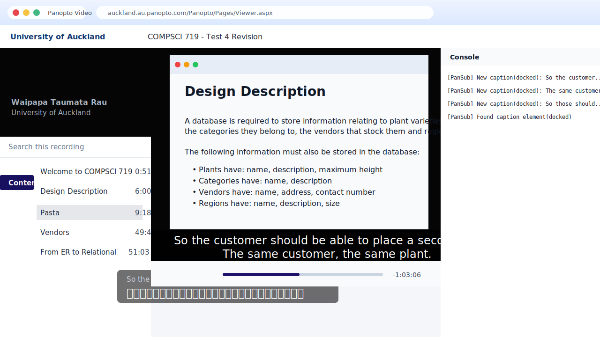

<p align="left">
  
</p>

<h1 align="left">PanSub</h1>

<p align="left">
  Chrome extension that adds real-time Chinese subtitles to Panopto lecture recordings.
</p>

<p align="left">
  <a href="https://chromewebstore.google.com/detail/chgafndhbmocpgbaellpbjckmnbkmdfe"><strong>Install from Chrome Web Store</strong></a>
</p>



## Live Translation Demo


This demo runs the real PanSub content script and Google Translate flow with sample lecture captions. It does not include private course footage or third-party course content.

## What It Does

PanSub watches the English caption text rendered by the Panopto player, sends the latest caption to Google Translate, and displays a bilingual overlay on top of the recording page.

It currently supports the two Panopto caption positions used by the player:

- On-video captions: `#overlayCaption`
- Docked captions below the video: `#dockedCaptionText`

When a new caption appears, PanSub shows the English line immediately, then fills in the Chinese translation when the translation request finishes.

## Features

- Real-time bilingual subtitles for Canvas / Panopto recordings
- Built-in academic glossary for business, arts, IT, science, law, and more
- Interface language switch for English or Chinese settings UI
- Display modes: bilingual, translation only, or original only
- Position modes: auto, video bottom, page bottom, or follow the Panopto caption element
- Adjustable subtitle size, overlay width, and background opacity
- Optional native Panopto caption hiding when captions overlap
- Small floating quick button for toggling PanSub while watching
- Local translation cache for repeated caption lines
- Debug logs for checking which Panopto caption node was detected

## Installation

### Install from Chrome Web Store

1. Open the [PanSub Chrome Web Store listing](https://chromewebstore.google.com/detail/chgafndhbmocpgbaellpbjckmnbkmdfe), or search for `PanSub` in the Chrome Web Store.
2. Click **Add to Chrome**.
3. Open a Canvas / Panopto recording and refresh the page if it was already open.
4. Turn on captions in the Panopto player.
5. Click the PanSub extension icon and make sure **Show subtitles** is enabled.
6. Click **Open settings** in the popup to adjust subtitle mode, position, size, opacity, cache, quick button, and interface language.

### Install from Source

Use this method if you want to inspect or modify the code locally.

1. Download or clone this repository.

   ```bash
   git clone https://github.com/hannnnnnnny/pansub.git
   ```

2. Open Chrome and go to:

   ```text
   chrome://extensions
   ```

3. Turn on **Developer mode** in the top-right corner.

4. Click **Load unpacked**.

5. Select the local `pansub` project folder. Select the folder that contains:

   ```text
   manifest.json
   content.js
   popup.html
   popup.js
   ```

6. Open a Panopto video and enable captions in the Panopto player.

7. Click the PanSub extension icon and make sure **Show subtitles** is enabled.

8. Click **Open settings** in the popup to adjust subtitle mode, position, size, opacity, cache, quick button, and interface language.

9. If you update the code later, go back to `chrome://extensions`, click the reload button on the PanSub card, then refresh the Panopto page.

Important: Chrome runs the exact local folder you selected with **Load unpacked**. If you edit a different folder, GitHub, or another clone, the browser extension will not update until you load or update the same local folder.

## Chrome Web Store Release

Current release version: `1.1.3`.

The clean extension package is generated as:

```text
dist/pansub-1.1.3.zip
```

The zip package keeps `manifest.json` at the package root and excludes `.git`, `dist`, temporary folders, source screenshots from other products, and local development files.

Store assets are included in this repository:

- Extension icons: `assets/icon16.png`, `assets/icon32.png`, `assets/icon48.png`, `assets/icon128.png`
- Main store screenshot: `assets/store/screenshot-main-1280x800.png`
- Settings screenshot: `assets/store/screenshot-settings-1280x800.png`
- Small promo tile: `assets/store/promo-small-440x280.png`
- Optional marquee promo tile: `assets/store/promo-marquee-1400x560.png`

Use [PRIVACY.md](PRIVACY.md) as the privacy policy source and [STORE_LISTING.md](STORE_LISTING.md) for copy-paste listing fields when preparing a public listing.

## Supported Sites

```json
[
  "*://*.panopto.com/*",
  "*://*.au.panopto.com/*"
]
```

If your Panopto site uses another domain, add it to `host_permissions` and `content_scripts.matches` in `manifest.json`.

## Files

```text
pansub/
├── assets/
│   ├── icon.svg
│   ├── icon16.png
│   ├── icon32.png
│   ├── icon48.png
│   ├── icon128.png
│   ├── demo.gif
│   ├── preview.svg
│   └── store/
│       ├── promo-marquee-1400x560.png
│       ├── promo-small-440x280.png
│       ├── screenshot-main-1280x800.png
│       └── screenshot-settings-1280x800.png
├── .gitignore
├── manifest.json
├── glossary.js
├── content.js
├── popup.html
├── popup.js
├── options.html
├── options.css
├── options.js
├── PRIVACY.md
├── STORE_LISTING.md
└── README.md
```

## Troubleshooting

- If no PanSub overlay appears, reload the extension in `chrome://extensions`, then refresh the Panopto page.
- If Chrome still shows old behavior, confirm that Chrome loaded the same local folder you are editing.
- If the native Panopto captions are visible but PanSub is not, open DevTools Console and check for logs like:

  ```text
  [PanSub] Found caption element(docked):
  [PanSub] New caption(docked):
  ```

- If your Panopto page uses a different caption element, inspect the caption text in DevTools and add the selector to `content.js`.

## Notes

- Translation uses the unofficial Google Translate `client=gtx` endpoint.
- Current caption text is sent to Google Translate for translation.
- Settings and the translation cache are stored locally with `chrome.storage.local`.
- PanSub does not include analytics, advertising, tracking pixels, or an author-owned remote server.
- See [PRIVACY.md](PRIVACY.md) for the full privacy policy.
- The extension requires Panopto captions to be turned on.
- Network speed and Google rate limits may affect translation latency.

## License

MIT

---

# PanSub 中文说明

PanSub 是一个 Chrome 扩展，用来给 Panopto 课程录像实时叠加中文字幕。


## 实时翻译演示


这段演示使用真实的 PanSub content script 和 Google Translate 翻译流程，字幕内容是示例课程句子，不包含真实课程录像或第三方课程内容。

## 功能

PanSub 会监听 Panopto 播放器渲染出来的英文字幕，把最新字幕发送到 Google Translate，然后在页面上显示双语悬浮字幕。

目前支持 Panopto 的两种字幕位置：

- 视频内字幕：`#overlayCaption`
- 视频下方停靠字幕：`#dockedCaptionText`

新字幕出现时，PanSub 会先立刻显示英文原文，等翻译请求完成后再补上中文翻译。

## 功能

- 支持 Canvas / Panopto 课程录像实时双语字幕
- 内置跨学科学术术语表，覆盖商科、艺术、IT、科学、法律等领域
- 设置界面支持英文 / 中文切换
- 显示模式：双语、仅中文、仅英文
- 位置模式：自动、视频底部、页面底部、跟随 Panopto 字幕元素
- 可调中文字幕大小、英文字幕大小、悬浮层宽度和背景透明度
- 原生 Panopto 字幕重叠时，可以选择隐藏原字幕
- 页面侧边悬浮快捷按钮，观看时可快速开关 PanSub
- 本地翻译缓存，重复字幕不需要反复请求
- 调试日志，方便查看命中了哪个 Panopto 字幕节点

## 安装方法

### 从 Chrome 应用商店安装

1. 打开 [PanSub Chrome 应用商店页面](https://chromewebstore.google.com/detail/chgafndhbmocpgbaellpbjckmnbkmdfe)，或者在 Chrome 应用商店搜索 `PanSub`。
2. 点击 **添加至 Chrome**。
3. 回到 Canvas / Panopto 课程录像页面；如果页面已经打开，先刷新一下。
4. 打开 Panopto 播放器自带字幕。
5. 点击 Chrome 工具栏里的 PanSub 图标，确认 **显示字幕** 开关是打开的。
6. 点击 popup 里的 **打开设置**，可以调整字幕模式、位置、大小、透明度、缓存、快捷按钮和界面语言。

### 从源码安装

如果你想查看或修改代码，可以使用这个方式。

1. 下载或克隆这个仓库。

   ```bash
   git clone https://github.com/hannnnnnnny/pansub.git
   ```

2. 打开 Chrome，进入：

   ```text
   chrome://extensions
   ```

3. 打开右上角的 **开发者模式**。

4. 点击 **加载已解压的扩展程序**。

5. 选择本地的 `pansub` 项目文件夹。这个文件夹里应该有：

   ```text
   manifest.json
   content.js
   popup.html
   popup.js
   ```

6. 打开 Panopto 视频，并在 Panopto 播放器里开启字幕。

7. 点击 Chrome 工具栏里的 PanSub 图标，确认 **显示字幕** 开关是打开的。

8. 点击 popup 里的 **打开设置**，可以调整字幕模式、位置、大小、透明度、缓存、快捷按钮和界面语言。

9. 如果之后更新了代码，需要回到 `chrome://extensions`，点击 PanSub 卡片上的刷新按钮，然后刷新 Panopto 页面。

注意：Chrome 运行的是你点击 **加载已解压的扩展程序** 时选中的那个本地文件夹。如果你改的是 GitHub 页面、另一个目录、或者另一个 clone，浏览器里的插件不会自动更新，必须更新并重新加载 Chrome 实际加载的那个文件夹。

## Chrome Web Store 发布

当前发布版本：`1.1.3`。

干净的扩展发布包会生成在：

```text
dist/pansub-1.1.3.zip
```

这个 zip 包会把 `manifest.json` 放在压缩包根目录，并排除 `.git`、`dist`、临时目录、来自其他产品的截图源文件和本地开发文件。

商店素材已经放在仓库里：

- 扩展图标：`assets/icon16.png`、`assets/icon32.png`、`assets/icon48.png`、`assets/icon128.png`
- 主效果截图：`assets/store/screenshot-main-1280x800.png`
- 设置页截图：`assets/store/screenshot-settings-1280x800.png`
- 小宣传图：`assets/store/promo-small-440x280.png`
- 可选横幅宣传图：`assets/store/promo-marquee-1400x560.png`

公开发布时，可以使用 [PRIVACY.md](PRIVACY.md) 作为隐私政策来源，并用 [STORE_LISTING.md](STORE_LISTING.md) 复制商店表单文案。

## 支持的网站

```json
[
  "*://*.panopto.com/*",
  "*://*.au.panopto.com/*"
]
```

如果你的 Panopto 使用其他域名，需要在 `manifest.json` 里的 `host_permissions` 和 `content_scripts.matches` 中添加对应地址。

## 文件结构

```text
pansub/
├── assets/
│   ├── icon.svg
│   ├── icon16.png
│   ├── icon32.png
│   ├── icon48.png
│   ├── icon128.png
│   ├── demo.gif
│   ├── preview.svg
│   └── store/
│       ├── promo-marquee-1400x560.png
│       ├── promo-small-440x280.png
│       ├── screenshot-main-1280x800.png
│       └── screenshot-settings-1280x800.png
├── .gitignore
├── manifest.json
├── glossary.js
├── content.js
├── popup.html
├── popup.js
├── options.html
├── options.css
├── options.js
├── PRIVACY.md
├── STORE_LISTING.md
└── README.md
```

## 常见问题

- 如果没有出现 PanSub 悬浮字幕，先在 `chrome://extensions` 里重新加载扩展，然后刷新 Panopto 页面。
- 如果 Chrome 还是旧效果，确认 Chrome 加载的本地文件夹就是你正在修改的文件夹。
- 如果 Panopto 原生英文字幕能看到，但 PanSub 没出现，打开 DevTools Console，看是否有类似日志：

  ```text
  [PanSub] Found caption element(docked):
  [PanSub] New caption(docked):
  ```

- 如果你的 Panopto 页面用了不同的字幕元素，需要在 DevTools 里检查真实字幕节点，并把选择器加到 `content.js`。

## 说明

- 翻译使用非官方 Google Translate `client=gtx` 接口。
- 当前字幕文本会发送到 Google Translate 用于翻译。
- 设置和翻译缓存会通过 `chrome.storage.local` 保存在本地。
- PanSub 不包含分析统计、广告、追踪像素或作者自建远程服务器。
- 完整隐私说明见 [PRIVACY.md](PRIVACY.md)。
- 必须先在 Panopto 播放器里开启字幕。
- 网络速度和 Google 限流可能影响翻译延迟。

## License

MIT
